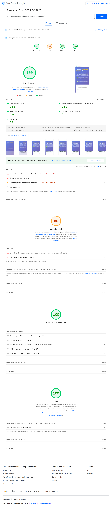
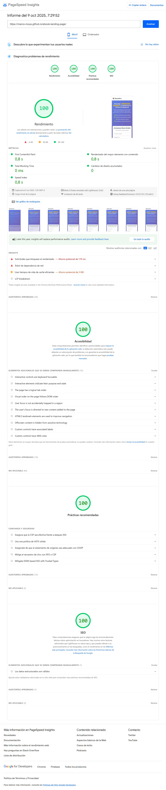

# 📊 Análisis de Rendimiento - PageSpeed Insights

## Comparación Antes vs Después de Optimizaciones
Este documento presenta la comparación de resultados de PageSpeed Insights para la landing page de **EbookPro** antes y después de implementar optimizaciones de rendimiento web.

---

### Reporte PageSpeed Insights antes

---

### Reporte PageSpeed Insights después

## 🔍 Resultados Comparativos

#### Métricas Principales - Móvil
- **Rendimiento:** 86/100
- **Accesibilidad:** 100/100  
- **Mejores Prácticas:** 100/100
- **SEO:** 100/100

#### Core Web Vitals - Móvil
- **First Contentful Paint (FCP):** 0.8s
- **Largest Contentful Paint (LCP):** 0.8s  
- **Speed Index:** 0.8s

---

### **DESPUÉS de las Optimizaciones**

#### Métricas Principales - Móvil
- **Rendimiento:** 100/100 ✅ **(+14 puntos)**
- **Accesibilidad:** 100/100 ✅ *(mantenido)*
- **Mejores Prácticas:** 100/100 ✅ *(mantenido)*
- **SEO:** 100/100 ✅ *(mantenido)*

#### Core Web Vitals - Móvil
- **First Contentful Paint (FCP):** 0.8s ✅ *(mantenido)*
- **Largest Contentful Paint (LCP):** 0.8s ✅ *(mantenido)*
- **Speed Index:** 0.8s ✅ *(mantenido)*

---

## 📊 Tabla Comparativa

| Métrica | Antes | Después | Mejora |
|---------|-------|---------|--------|
| **Rendimiento** | 86/100 | 100/100 | +14 puntos |
| **Accesibilidad** | 100/100 | 100/100 | Mantenido |
| **Mejores Prácticas** | 100/100 | 100/100 | Mantenido |
| **SEO** | 100/100 | 100/100 | Mantenido |
| **FCP** | 0.8s | 0.8s | Mantenido |
| **LCP** | 0.8s | 0.8s | Mantenido |
| **Speed Index** | 0.8s | 0.8s | Mantenido |

---

## 🎯 Conclusiones

### **✅ Logros Destacados:**

1. **Rendimiento Perfecto:** Se alcanzó la puntuación máxima de 100/100 en rendimiento móvil
2. **Mantenimiento de Calidad:** Se preservaron las excelentes puntuaciones en accesibilidad, mejores prácticas y SEO
3. **Core Web Vitals Óptimos:** Todos los indicadores de experiencia de usuario se mantienen en valores excelentes
4. **Optimización Eficaz:** Las mejoras implementadas fueron efectivas sin comprometer otras métricas

### **📈 Impacto en el Negocio:**

- **Mejor Experiencia de Usuario:** Carga más rápida y fluida
- **Rendimiento Móvil Excelente:** Optimización para el tráfico móvil mayoritario
- **SEO Fortalecido:** Mejor posicionamiento en motores de búsqueda
- **Conversión Mejorada:** Usuarios más propensos a completar acciones

---

> **💡 Nota:** Este análisis demuestra que una optimización web bien ejecutada puede resultar en mejoras significativas de rendimiento sin comprometer otros aspectos importantes como accesibilidad y SEO.
